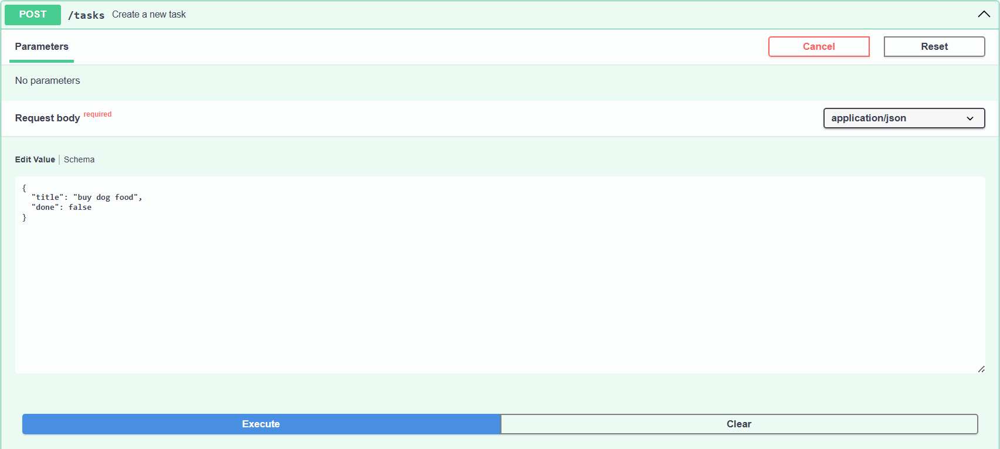

# Task API

## A simple CRUD API for managing tasks

This Python project was built during my internship at FlyRank AI, where I was tasked with building my first CRUD API to get a feel for the "heartbeat" of every backend in the world, and build familiarity with Git.

### Getting Started

Install dependencies:

```
pip install -r requirements.txt
```

Start the server:

```
uvicorn task:app --reload
```

The API runs at ``http://localhost:8000/``. OpenAPI docs (Swagger UI) are at ``http://localhost:8000/docs``.

### Endpoints

| Method | Path             | Description                   |
| ------ | ---------------- | ----------------------------- |
| GET    | /                | Display basic API information |
| GET    | /health          | Check if server is alive      |
| GET    | /tasks           | Return all tasks              |
| GET    | /tasks/{task_id} | Return a single task by ID    |
| POST   | /tasks           | Create a new task             |
| PUT    | /tasks           | Update a task by ID           |
| DELETE | /tasks           | Delete a task by ID           |

### Example:

Let's create a new task together, called "feed dog.":

```
curl -X POST http://localhost:8000/tasks -H "Content-Type:application/json" -d '{"title": "feed dog"}'
```

This should then create a new task, and return:

```JSON
{
  "id": 4,
  "title": "buy dog food",
  "done": false
}
```

This can also be done in Swagger UI by inputting text below, and pressing **execute**.


