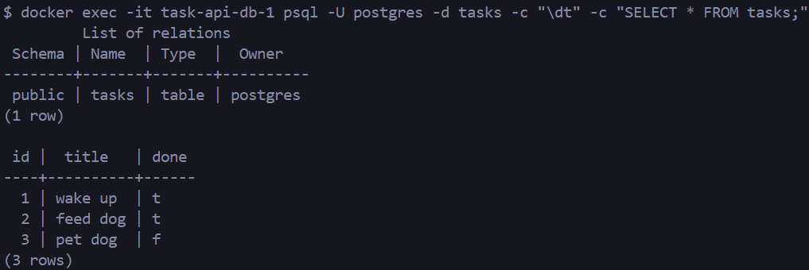

 Task API - V3

## A simple CRUD API for managing tasks

This Python project was built during my internship at FlyRank AI. Assignment 3 containerized the stack, meaning that the app and database now run in Docker, connected through Docker Compose.

### Getting Started

Copy the example .env file, and adjust if needed:

```
cp .env.example .env
```

Start everything with one command:

```
docker compose up
```

The API runs at ``http://localhost:8000/``. OpenAPI docs (Swagger UI) are at ``http://localhost:8000/docs``.

### Endpoints

| Method | Path             | Description                   |
| ------ | ---------------- | ----------------------------- |
| GET    | /                | Display basic API information |
| GET    | /health          | Check if server is alive      |
| GET    | /tasks           | Return all tasks              |
| GET    | /tasks/{task_id} | Return a single task by ID    |
| POST   | /tasks           | Create a new task             |
| PUT    | /tasks/{task_id} | Update a task by ID           |
| DELETE | /tasks/{task_id} | Delete a task by ID           |

### Example:

Let's create a new task together, called "buy dog food":

```
curl -i -X POST http://localhost:8000/tasks -H "Content-Type:application/json" -d '{"title": "buy dog food"}'
```

This should then create a new task, and return:

```JSON
HTTP/1.1 201 Created
date: Fri, 24 Jul 2026 05:35:01 GMT
server: uvicorn
content-length: 44
content-type: application/json

{
  "id":4,
  "title":"buy dog food",
  "done":false
}
```

This can also be done in Swagger UI by inputting text below, and pressing **execute**.


## Postgres

Data lives in a Postgres container rather than a local file. the `db` service in `compose.yaml` stores data in a Docker volume (`taskdata`), so tasks survive `docker compose down` followed by `docker compose up`.


To view data directly: `docker exec -it task-api-db-1 psql -U postgres -d tasks -c "SELECT * FROM tasks;"`


