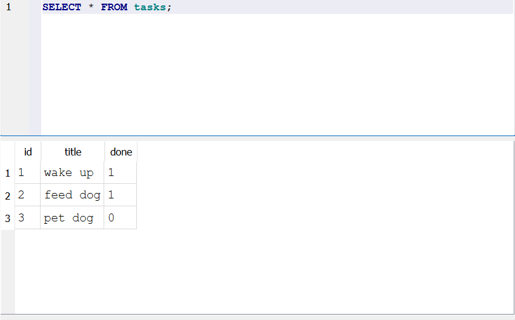

# Task API

## A simple CRUD API for managing tasks

This Python project was built during my internship at FlyRank AI, where I was tasked with building my first CRUD API to get a feel for the "heartbeat" of every backend in the world, and build familiarity with Git.

### Getting Started

Install dependencies:

```
pip install -r requirements.txt
```

Start the server:

```
uvicorn task:app --reload
```

The API runs at ``http://localhost:8000/``. OpenAPI docs (Swagger UI) are at ``http://localhost:8000/docs``.

Start Postgres in Docker:

```
docker run --name taskdb -e POSTGRES_PASSWORD=dev -e POSTGRES_DB=tasks -p 5432:5432 -v taskdata:/var/lib/postgresql/data -d postgres
```

### Endpoints

| Method | Path             | Description                   |
| ------ | ---------------- | ----------------------------- |
| GET    | /                | Display basic API information |
| GET    | /health          | Check if server is alive      |
| GET    | /tasks           | Return all tasks              |
| GET    | /tasks/{task_id} | Return a single task by ID    |
| POST   | /tasks           | Create a new task             |
| PUT    | /tasks/{task_id} | Update a task by ID           |
| DELETE | /tasks/{task_id} | Delete a task by ID           |

### Example:

Let's create a new task together, called "buy dog food":

```
curl -X POST http://localhost:8000/tasks -H "Content-Type:application/json" -d '{"title": "buy dog food"}'
```

This should then create a new task, and return:

```JSON
{
  "id": 4,
  "title": "buy dog food",
  "done": false
}
```

This can also be done in Swagger UI by inputting text below, and pressing **execute**.


## SQLite & DB Browser

### Why Use SQLite?

Since SQLite is just a single file, it does not require any administration or setup. It is also a common choice for small projects, teaching, and simple situations with little-medium traffic. This project has very light traffic, and SQLite makes it so that data survives upon restart, making it the perfect tool for the job.

### Where the Database File is Stored

Tasks are stored in ``tasks.db``, which is created the first time the app runs. Note that it is also gitignored, so cloning the repo should start a fresh workspace where the table and three example tasks are set up for you on initial launch.

### Running DB Browser

Using the query:

```SQL
SELECT * FROM tasks;
```

It returns the entire table of our database, as shown below (with only sample tasks):


