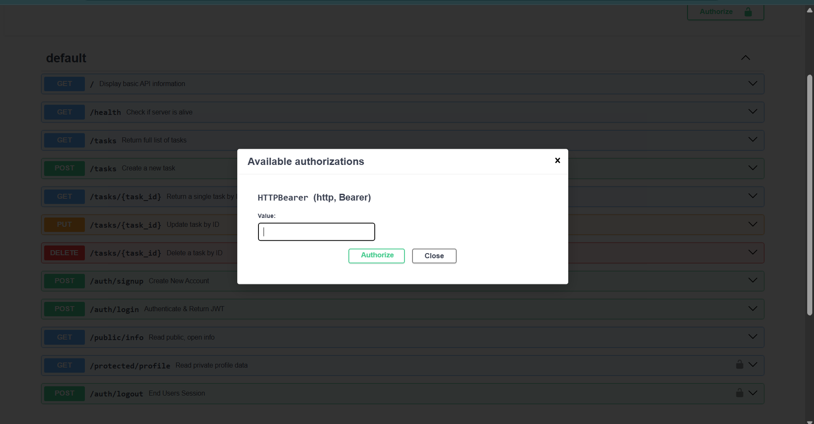

# Task API

A REST API for managing tasks, build with FastAPI and PostgreSQL, and secured with Supabase Auth.

This Python project was built during my internship at Flyrank AI. The latest set of updates implemented Supabase Auth, where user accounts and JWTs are handled entirely bu Supabase. This project never stores or hashes a password itself. Public routes are open to anyone, whereas protected routes require a valid access token.

Interactive API docs are available at `/docs` via Swagger UI, with bearer token support built in.

## Tech Stack

- FastAPI
- PostgreSQL
- Supabase
- Swagger UI

## Prerequisites

- Docker Desktop
- A Supabase project

## Environment Variables

Copy the example .env file, and adjust if needed:

```
cp .env.example .env
```

| Variable     | Required | Description                                          |
| ------------ | -------- | ---------------------------------------------------- |
| DATABASE_URL | Yes      | Postgres connection string used by the API container |
| SUPABASE_URL | Yes      | Supabase project URL                                 |
| SUPABASE_KEY | Yes      | Supabase anon/public API key                         |

Example `.env` for Supabase

```
DATABASE_URL=postgresql://postgres:postgres@db:5432/postgres
SUPABASE_URL=https://your-project.supabase.co
SUPABASE_KEY=your_anon_key
```

## Getting Started

Start everything with one command

```
docker compose up
```

The API runs at ``http://localhost:8000/``. OpenAPI docs (Swagger UI) are at ``http://localhost:8000/docs``.

## Authentication

Protected endpoint require a bearer token in the Authorization header:

```
Authorization: Bearer <access_token>
```

Get a token by calling `POST /auth/login` with valid credentials. The response includes an `access_token` and a `refresh_token`.

## API Reference

| Method | Path               | Description                                           |
| ------ | ------------------ | ----------------------------------------------------- |
| GET    | /                  | Display basic API information                         |
| GET    | /health            | Check if server is alive                              |
| GET    | /tasks             | Return all tasks                                      |
| GET    | /tasks/{task_id}   | Return a single task by ID                            |
| POST   | /tasks             | Create a new task                                     |
| PUT    | /tasks/{task_id}   | Update a task by ID                                   |
| DELETE | /tasks/{task_id}   | Delete a task by ID                                   |
| POST   | /auth/signup       | Register new user with email and password             |
| POST   | /auth/login        | Authenticate and receive JWT tokens                   |
| POST   | /auth/logout       | Sign out of current session                           |
| GET    | /public/info       | Public endpoint with welcome message                  |
| GET    | /protected/profile | Return authenticated user id, email and creation date |

### Example: Creating a Task

Let's create a new task together, called "buy dog food":

```
curl -i -X POST http://localhost:8000/tasks -H "Content-Type:application/json" -d '{"title": "buy dog food"}'
```

This should then create a new task, and return:

```JSON
HTTP/1.1 201 Created
date: Fri, 24 Jul 2026 05:35:01 GMT
server: uvicorn
content-length: 44
content-type: application/json

{
  "id":4,
  "title":"buy dog food",
  "done":false
}
```

This can also be done in Swagger UI by inputting text below, and pressing **execute**.


## Example: Auth Flow

Sign up:

```
curl -X POST http://127.0.0.1:8000/auth/signup \
  -H "Content-Type: application/json" \
  -d '{"email":"user@example.com","password":"password123"}'
```

Login:

```
curl -X POST http://127.0.0.1:8000/auth/login \
  -H "Content-Type: application/json" \
  -d '{"email":"user@example.com","password":"password123"}'
```

Access a protected route:

```
curl http://127.0.0.1:8000/protected/profile \
  -H "Authorization: Bearer <access_token>"
```

## Swagger UI

Open `http://localhost:8000/docs` to explore and text every endpoint in browser.
Protecter routes show a lock icon. To test them:

1. Call `POST /auth/login` and copy the `access_token`
2. Click **Authorize** and paste the token
3. Use **Try it out** on any protected endpoint
   

## Postgres

Data lives in a Postgres container rather than a local file. the `db` service in `compose.yaml` stores data in a Docker volume (`taskdata`), so tasks survive `docker compose down` followed by `docker compose up`.

To view data directly: `docker exec -it task-api-db-1 psql -U postgres -d tasks -c "SELECT * FROM tasks;"`


## Project Structure

```
task.py
requirements.txt
compose.yaml
dockerfile
.env.example
```
